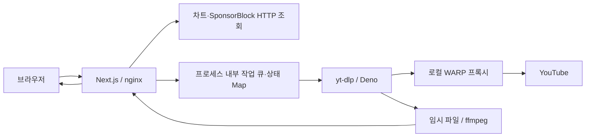
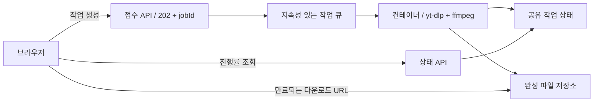

# Y2V Music 서버리스 마이그레이션 검토

검토일: 2026-09-26. 로컬 코드, README/CLAUDE의 운영 기록, 공식 플랫폼 문서를 근거로 작성했다. 운영 서버나 대상 플랫폼에서 추출을 실측한 결과는 아니다. 아래 적합도와 권고는 이 근거에 따른 설계 판단이다.

**판정: 마이그레이션은 가능하지만, 현재 프로젝트를 그대로 배포하는 방식으로는 어렵다.** 화면과 HTTP 조회 API는 이전하기 쉽다. 오디오 추출·변환과 작업 상태 관리는 별도 설계가 필요하다. 우선 권고는 Vercel 프런트엔드 + 기존 Oracle 처리 서버이며, VM 관리까지 없애려면 Cloudflare Containers 또는 Cloud Run을 검증하는 편이 적합하다.

## 현재 구조

- 설치된 버전: Next.js 15.5.18, React 19.2.6, TypeScript 5.9.3. Next.js App Router 기반 단일 페이지와 Route Handler 6개로 구성되어 있다.
- UI는 클라이언트 중심이다. 다운로드 이력·선호 포맷·테마는 localStorage, 미리듣기는 YouTube iframe을 이용한다. 서버 DB는 없다.
- 운영 문서 기준 Oracle Cloud Ubuntu VM에서 Next.js를 PM2 단일 프로세스로 실행하고 nginx가 앞에 있다.
- 다운로드는 한 HTTP 요청에서 큐 대기 → 영상 정보 확보 → yt-dlp 추출 → ffmpeg 변환·태그·앨범아트 → 파일 스트리밍까지 수행한다.
- 진행률은 클라이언트가 `/api/status`를 1.5초마다 조회한다. 서버의 상태 Map과 동시성 제한 객체는 프로세스 로컬이다.
- yt-dlp·ffmpeg 외에 Python, Deno, yt-dlp 설정 파일, WARP 프록시가 운영 환경에 의존한다. 이 환경 전체가 package.json으로 재현되는 것은 아니다.

| 기능 | 현재 구현 | 이전 판단 |
|---|---|---|
| 화면·설정·이력·미리듣기 | React, localStorage, iframe | 수월. 도메인 변경 시 기존 localStorage는 자동 이전되지 않음 |
| 국가별 차트 3개 | YouTube Data API v3 HTTPS 조회 | 수월. API 키와 캐시 처리 필요 |
| 장르 선곡 9개 | yt-dlp로 RDCLAK 플레이리스트 조회 | 추출 실행 환경 필요. API 대체는 목록별 검증 필요 |
| 검색 | yt-dlp `ytsearch20:` | 추출 서버 유지 또는 HTTP API로 재구현 |
| 영상 정보 | yt-dlp `--dump-json`, 오디오 코덱·비트레이트 포함 | 제목만 조회하는 API로는 현재 기능을 대체할 수 없음 |
| 구간 제안 | SponsorBlock HTTP 조회, SHA-256 | 수월. 대상 런타임의 crypto 호환성 확인 |
| 추출·포맷 변환·자르기 | 외부 프로세스, 로컬 파일 | 주요 이전 대상. 일반 Workers 내부 실행 불가 |
| 작업 상태·동시성 제한 | Map, 단일 프로세스 세마포어 | 다중 인스턴스에서는 공유 상태·작업 분배 설계 필요 |

관련 코드: [다운로드](../app/api/download/route.ts), [프로세스 실행](../lib/process.ts), [yt-dlp](../lib/ytdlp.ts), [변환](../lib/ffmpeg.ts), [작업 상태](../lib/job-registry.ts), [동시성 제한](../lib/admission.ts).

## 이전을 막는 구체적인 지점

**1. 외부 프로세스 실행**

`lib/process.ts`는 `node:child_process.spawn`, 프로세스 그룹 종료, 우선순위 조정을 사용한다. 검색·정보·장르 차트도 이 경로에 의존하므로 `/api/download`만 분리해서는 Workers로 이전할 수 없다. Workers의 Node.js 호환 모드에서 `child_process`는 import 가능한 비동작 stub이다. [Cloudflare Node.js 호환성](https://developers.cloudflare.com/workers/runtime-apis/nodejs/)

**2. 단일 서버 메모리에 의존하는 상태**

`lib/job-registry.ts:39`의 Map을 다른 함수 인스턴스가 읽을 수 없다. 다운로드가 인스턴스 A, 상태 조회가 B로 가면 `unknown`이 나올 수 있다. `lib/admission.ts:164`의 동시 실행 1개도 전체 서비스가 아닌 인스턴스별 1개가 된다. warm instance가 재사용되더라도 동일 인스턴스 도착은 보장할 수 없다.

차트·영상 정보·SponsorBlock 캐시는 없어져도 다시 조회할 수 있어 기능상 필수 영속 데이터는 아니다. 다만 캐시가 인스턴스마다 갈라지면 외부 호출이 늘고, 차트의 24시간 stale fallback도 일관되게 제공할 수 없다. 정확한 작업 상태·전역 동시성 제어와 캐시를 구분해서 이전해야 한다.

**3. 실행 시간**

다운로드 라우트의 `maxDuration = 3600`은 플랫폼 제한을 늘려주지 않는다. 다운로드 큐는 최대 180초, yt-dlp 다운로드는 호출당 15분, ffmpeg 변환은 15분을 허용한다. 정보 조회·썸네일·파일 전송 시간도 추가된다. 429에 한해 최대 2회 재시도하므로 단일 요청 전체 예산은 별도 계산이 필요하다.

짧은 음악 파일의 평균 처리 시간만 보고 전체 지원 범위가 맞는다고 판단하면 안 된다. 3시간 미만 영상까지 유지할지, 짧은 곡만 지원하도록 축소할지에 따라 플랫폼 선택이 달라진다.

**4. 임시 저장 공간**

`lib/temp.ts:5`는 `process.cwd()/temp`에 쓴다. 일반 Vercel Functions에서는 `/tmp` 등 허용되는 임시 경로로 변경해야 한다. 공식 런타임 문서의 임시 공간은 최대 500MB다. [Vercel 런타임 파일시스템](https://vercel.com/docs/functions/runtimes)

현재 `500M`은 yt-dlp 입력 다운로드 제한이고, 변환 결과나 작업 디렉터리 전체 크기 제한이 아니다. 입력과 출력이 동시에 남으며 FLAC은 원본 압축 오디오보다 커질 수 있다. 경로만 고쳐서는 충분하지 않다. 결과 파일 크기, 작업별 최대 디스크 사용량, 동시 실행 수를 함께 제한해야 한다.

**5. YouTube 접속 환경**

`CLAUDE.md`는 서버 외부 설정 `~/.config/yt-dlp/config`의 프록시와 EJS 설정, Deno, systemd의 WARP 서비스를 기록한다. 새 플랫폼에 코드만 배포하면 이 설정은 따라가지 않는다. 일반 함수 환경에서 기존 systemd 서비스를 그대로 유지하는 구조도 성립하지 않는다.

Cloudflare Workers/Containers를 사용한다는 사실이 기존 WARP 프록시의 네트워크 경로를 재현하지는 않는다. 대상 리전·출구 IP에서 실제 추출 성공률을 먼저 검증해야 한다. 컨테이너에서 바이너리가 실행된다는 사실만으로 YouTube 다운로드 성공을 보장할 수 없다.

**6. 다운로드 전달 방식**

현재 서버는 변환이 끝난 후 `Readable.toWeb(createReadStream(...))`으로 파일을 스트리밍한다. Vercel은 일반 응답의 4.5MB 제한을 안내하면서 큰 응답의 대안으로 스트리밍도 명시한다. 따라서 “4.5MB를 넘으니 무조건 불가능”이라는 결론은 부정확하다. 실제 배포 경로의 스트리밍 동작·헤더·최대 실행 시간은 실측해야 한다. [Vercel 대용량 응답 안내](https://vercel.com/kb/guide/how-to-bypass-vercel-body-size-limit-serverless-functions)

클라이언트는 `app/page.tsx:555`부터 모든 청크를 메모리에 모은 뒤 Blob을 만든다. 이는 대용량 FLAC이나 모바일에서 부담이다. 완성 파일을 저장한 후 만료되는 다운로드 URL을 발급하면 함수의 파일 중계와 브라우저 전체 버퍼링을 줄일 수 있다. 브라우저 기본 다운로드를 사용한다면 앱에서 전송 완료를 정확히 관측할 수 있는 범위도 달라지므로 진행률 UI를 함께 조정해야 한다.

## 플랫폼별 판단

| 구성 | 가능성 | 필요한 변경·제약 | 권고 |
|---|---|---|---|
| 현재 코드를 일반 Vercel Functions에 그대로 배포 | 그대로는 부적합 | 바이너리 패키징, 임시 경로, 요청 시간, 상태 공유, 네트워크 의존성 | 권장하지 않음 |
| Vercel Functions에 맞춰 전체 개편 | 조건부 가능 | 작업 분리, 공유 상태, 파일 전달 변경, 지원 길이·용량 재검토 | 짧은 곡 중심 PoC 후보 |
| Vercel Container Images | 조건부 가능 | 시스템 의존성 패키징에 유리하나 함수 제한·상태 문제는 유지 | 베타와 실행 제한을 수용할 때 검토 |
| 일반 Cloudflare Workers만 사용 | 현재 기능 그대로는 불가 | yt-dlp/ffmpeg 자식 프로세스 실행 불가 | UI·조회·작업 접수 계층에 활용 |
| Workers + Cloudflare Containers | 가능성 높음 | Linux 실행 환경, 컨테이너 수명·라우팅, 공유 상태, 파일 저장, 네트워크 검증 | Cloudflare 내 완전 이전 후보 |
| Vercel UI + 기존 Oracle 처리 서버 | 가능성 높음 | API 경계·라우팅, 도메인·CORS, 다운로드 경로 | 가장 작은 변경으로 시작하는 권고안 |
| UI + Cloud Run 처리 서비스/작업 | 가능성 높음 | 컨테이너화, 상태·파일 외부화, 메모리·네트워크 검증 | VM 운영 제거 후보 |

Vercel Fluid Compute의 현재 시간 제한은 Hobby 최대 300초, Pro/Enterprise 일반 최대 800초다. 1800초 확장은 베타이며 지원 런타임·설정 조건이 있다. 기본 Node.js 번들은 250MB이고 큰 함수는 최대 5GB 베타 경로가 있다. 패키지 용량과 임시 디스크 용량은 서로 다른 제한이다. [Vercel Functions 제한](https://vercel.com/docs/functions/limitations)

Vercel Container Images는 모든 요금제에 베타로 제공되고 시스템 도구를 이미지에 포함할 수 있다. 하지만 Vercel Functions의 제한을 그대로 적용하며 유휴 시 축소된다. 30분 확장도 컨테이너에 자동 적용된다고 가정해서는 안 되고 선택한 실행 경로의 지원 여부를 확인해야 한다. [Vercel Container Images](https://vercel.com/docs/functions/container-images)

Workers는 isolate당 128MB, 유료 HTTP 요청 CPU 시간은 기본 30초에서 최대 5분으로 설정할 수 있다. 이는 네트워크 대기까지 포함한 벽시계 시간과 다르다. WASM 변환으로 바꾸더라도 현재 yt-dlp·Deno와 로컬 파일 파이프라인 전체가 대체되지는 않는다. [Workers 제한](https://developers.cloudflare.com/workers/platform/limits/)

Cloudflare의 현재 Next.js 가이드는 vinext를 권장하며 vinext는 베타다. 기존 OpenNext 경로와 정적 export 경로도 문서화되어 있다. 어느 어댑터를 쓰든 Workers 내부에서 외부 CLI를 실행할 수 없는 점은 같다. [Cloudflare Next.js 가이드](https://developers.cloudflare.com/workers/framework-guides/web-apps/nextjs/)

Cloudflare Containers는 Workers Paid에서 제공되는 별도 실행 환경으로 Linux 도구와 더 큰 CPU·메모리·디스크를 사용할 수 있다. 디스크는 컨테이너가 잠들면 초기화된다. 실행 중인 작업을 유휴로 잘못 판단해 종료하지 않도록 수명 관리가 필요하다. [Containers 개요](https://developers.cloudflare.com/containers/), [Containers FAQ](https://developers.cloudflare.com/containers/faq/)

Cloud Run 서비스는 HTTP 요청을 최대 60분으로 설정할 수 있어 현재 처리 흐름의 후보가 된다. 다만 기본 writable filesystem은 메모리를 소비하고 종료 시 사라진다. 현재 VM처럼 임시 디스크를 취급하면 메모리 부족이 날 수 있다. [Cloud Run 시간 제한](https://docs.cloud.google.com/run/docs/configuring/request-timeout), [컨테이너 실행 계약](https://docs.cloud.google.com/run/docs/container-contract)

## 권고하는 이전 순서

**1단계: UI와 처리 서버 분리**

Vercel에 Next.js UI를 배포하고, 우선 `/api/info`, `/api/search`, `/api/charts`, `/api/download`, `/api/status`를 기존 Oracle 서버에서 처리한다. `/api/segments`와 Data API 기반 차트만 별도로 이전하는 것은 이후 최적화로 둬도 된다. 기존 yt-dlp 환경과 단일 서버 상태 공유를 보존하므로 변화 범위가 작다.

브라우저의 API 경로를 명시적으로 설정하고, 교차 출처라면 허용 origin과 필요한 응답 헤더 노출을 설정한다. CORS는 인증이 아니므로 접근 통제를 대신하지 않는다. 큰 파일과 장시간 추출은 Vercel 함수에서 단순 중계하지 않고 처리 서버로 직접 연결하는 편이 명확하다. 같은 출처 프록시를 선택한다면 해당 프록시의 연결 시간 제한을 별도로 검증한다.

기존 nginx/localhost 방어는 유지한다. 새 컨테이너가 요구하는 포트 바인딩은 별도 이미지 설정으로 다루며 운영 VM의 바인딩을 임의 변경하지 않는다. 도메인이 바뀌면 localStorage 이력·설정이 따라오지 않으므로 동일 origin 유지 또는 내보내기/가져오기를 고려한다.

이 단계로 프런트엔드 빌드·배포를 VM에서 분리할 수 있지만 추출 CPU나 WARP 운영은 남는다. 다운로드 자체의 속도 향상을 보장하는 이전은 아니다.

**2단계: VM을 없앨 때 비동기 작업으로 개편**

- 다운로드 POST는 완료까지 기다리는 대신 작업 ID를 반환한다. `queued/running/completed/failed`와 단계별 진행률을 공유 저장소에서 관리한다.
- 큐에서 재전달되는 작업을 고려해 작업 ID 기반 중복 실행 방지, lease/heartbeat, 제한된 재시도, 실패 상태를 설계한다.
- 실행 슬롯은 웹 요청 개수가 아닌 실제 변환 작업 수에 맞춰 관리한다. 상태 조회와 검색이 변환 때문에 막히지 않아야 한다.
- 결과 파일은 별도 저장하고 짧은 보관 기간 및 정리 정책을 둔다. 다운로드 URL의 접근 범위와 만료 시간을 제한한다.
- HTTP 응답을 202로 바꾸고 함수 안에서 Promise만 계속 실행하는 방식은 지속성 있는 작업 실행을 보장하지 않는다. 실제 큐 소비자나 작업 실행기를 사용한다.
- 기존의 URL 검증, 썸네일 허용목록, shell 없는 spawn, 프로세스 종료, 요청별 파일 정리는 컨테이너에서도 유지한다.
- 인증을 원하지 않는 기존 운영 선호가 있으므로 로그인 추가를 전제하지 않는다. 유료 자동 확장 전에는 요청 제한·최대 인스턴스·사용량 상한 등 비용 통제 방식을 결정해야 한다.

## 실제 이전 결정 전 검증

우선 대상 실행 환경에서 정보 조회, 검색, 짧은 MP3와 OPUS 추출을 반복해 성공률과 시간을 측정한다. 이 단계에서 YouTube 접근이 안정적이지 않으면 대규모 코드 개편을 진행할 이유가 없다. 이후 다음 항목을 확인한다.

1. 콜드 스타트 포함 처리 시간, yt-dlp·Deno·ffmpeg와 필요한 코덱 실행 여부.
2. 긴 영상·FLAC의 최대 메모리와 입력+출력+부분 파일의 최대 저장 공간.
3. 인스턴스가 나뉘어도 진행률과 전체 동시 실행 제한이 맞는지.
4. 요청 재시도·인스턴스 종료·배포 중단 시 중복 작업과 잔여 파일 처리.
5. 파일명·메타데이터·앨범아트·자르기 품질, 모바일 대용량 다운로드.
6. 실제 다운로드 전송 경로의 응답 크기·연결 시간·헤더·재개 지원 여부.
7. 월 사용량별 CPU·메모리·저장소·전송 비용과 1.5초 폴링 비용.

현재 Oracle Free Tier보다 서버리스가 반드시 저렴하다고 볼 근거는 없다. 월 작업 수, 실제 CPU 초, 메모리 GB-초, 결과 파일 총 전송량, 유휴 컨테이너 유지 시간을 측정한 뒤 비교해야 한다. 2분 작업은 현재 폴링 주기라면 약 80회의 상태 요청을 추가한다. Vercel은 CPU와 할당 메모리 시간, Cloudflare Containers는 CPU·할당 메모리·디스크 비용을 함께 검토해야 한다. [Vercel 비용 설명](https://vercel.com/docs/functions/limitations), [Containers 과금](https://developers.cloudflare.com/containers/platform/pricing/)

## 이번 검토의 확인 범위

- 애플리케이션 코드와 운영 문서, 공식 Vercel·Cloudflare·Google Cloud 문서 확인.
- `node node_modules/typescript/bin/tsc --noEmit --incremental false` 실행 시 타입 오류 없음.
- 앱 코드·설정·의존성·운영 환경 변경 없음. 이 검토 문서만 추가.
- 대상 플랫폼 배포, 비용 발생 리소스 생성, 운영 서버 접근, 실제 YouTube 추출 테스트는 수행하지 않음.
- Vercel CLI가 설치되지 않은 환경이다. 실제 PoC를 진행한다면 `npm i -g vercel` 설치를 강하게 권장한다. 환경 변수 동기화·배포·로그 확인에 `vercel env pull`, `vercel deploy`, `vercel logs`를 사용할 수 있다.
